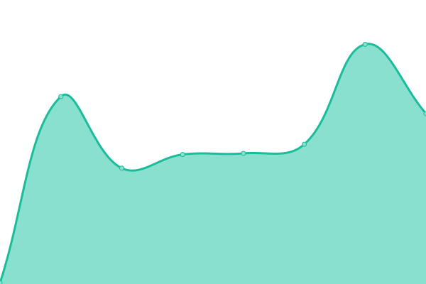
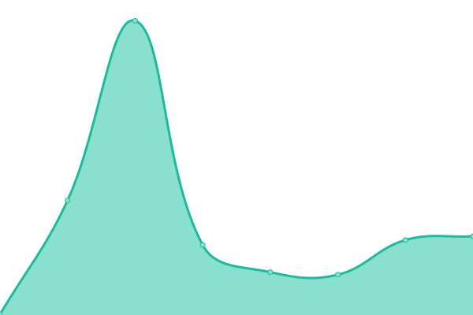
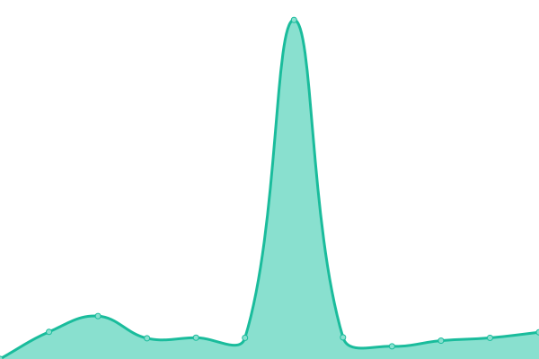

# [📈 Live Status](https://myles.github.io/uptime): <!--live status--> **🟩 All systems operational**

This repository contains the open-source uptime monitor and status page for [Myles Braithwaite](https://mylesb.ca), powered by [Upptime](https://github.com/upptime/upptime).

With [Upptime](https://upptime.js.org), you can get your own unlimited and free uptime monitor and status page, powered entirely by a GitHub repository. We use [Issues](https://github.com/myles/uptime/issues) as incident reports, [Actions](https://github.com/myles/uptime/actions) as uptime monitors, and [Pages](https://myles.github.io/uptime) for the status page.

<!--start: status pages-->
<!-- This summary is generated by Upptime (https://github.com/upptime/upptime) -->
<!-- Do not edit this manually, your changes will be overwritten -->
<!-- prettier-ignore -->
| URL | Status | History | Response Time | Uptime |
| --- | ------ | ------- | ------------- | ------ |
|  [myles.garden](https://myles.garden) | 🟩 Up | [myles-garden.yml](https://github.com/myles/uptime/commits/HEAD/history/myles-garden.yml) | 

 286ms
     
 | 

<a href="https://status.mylesbraithwaite.net/history/myles-garden">100.00%</a>
    

|  [mylesb.ca](https://mylesb.ca) | 🟩 Up | [mylesb-ca.yml](https://github.com/myles/uptime/commits/HEAD/history/mylesb-ca.yml) | 

 130ms
     
 | 

<a href="https://status.mylesbraithwaite.net/history/mylesb-ca">100.00%</a>
    

|  [myles.social](https://myles.social) | 🟩 Up | [myles-social.yml](https://github.com/myles/uptime/commits/HEAD/history/myles-social.yml) | 

 340ms
     
 | 

<a href="https://status.mylesbraithwaite.net/history/myles-social">100.00%</a>
    

|  [fr.myles.social](https://fr.myles.social) | 🟩 Up | [fr-myles-social.yml](https://github.com/myles/uptime/commits/HEAD/history/fr-myles-social.yml) | 

 367ms
     
 | 

<a href="https://status.mylesbraithwaite.net/history/fr-myles-social">100.00%</a>
    

|  [myles.wiki](https://myles.wiki) | 🟩 Up | [myles-wiki.yml](https://github.com/myles/uptime/commits/HEAD/history/myles-wiki.yml) | 

 284ms
     
 | 

<a href="https://status.mylesbraithwaite.net/history/myles-wiki">100.00%</a>
    

|  [mylesbraithwaite.com](https://mylesbraithwaite.com) | 🟩 Up | [mylesbraithwaite-com.yml](https://github.com/myles/uptime/commits/HEAD/history/mylesbraithwaite-com.yml) | 

 258ms
     
 | 

<a href="https://status.mylesbraithwaite.net/history/mylesbraithwaite-com">100.00%</a>
    

|  [trex.studio](https://trex.studio) | 🟩 Up | [trex-studio.yml](https://github.com/myles/uptime/commits/HEAD/history/trex-studio.yml) | 

 293ms
     
 | 

<a href="https://status.mylesbraithwaite.net/history/trex-studio">100.00%</a>
    

|  [trex.house](https://trex.house) | 🟩 Up | [trex-house.yml](https://github.com/myles/uptime/commits/HEAD/history/trex-house.yml) | 

 293ms
     
 | 

<a href="https://status.mylesbraithwaite.net/history/trex-house">100.00%</a>
    

<!--end: status pages-->

[**Visit our status website →**](https://myles.github.io/uptime)

## 📄 License

- Powered by: [Upptime](https://github.com/upptime/upptime)
- Code: [MIT](./LICENSE) © [Anand Chowdhary](https://anandchowdhary.com), supported by [Pabio](https://pabio.com)
- Data in the `./history` directory: [Open Database License](https://opendatacommons.org/licenses/odbl/1-0/)
